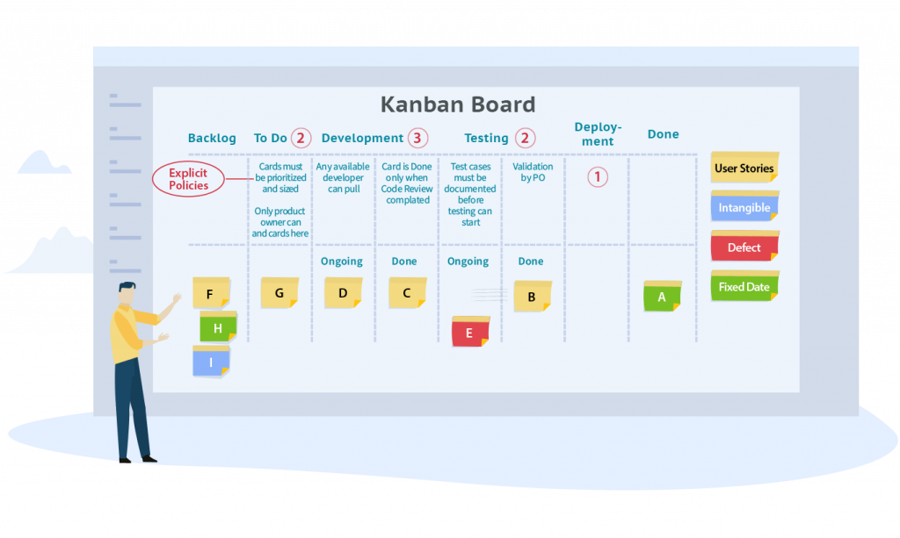
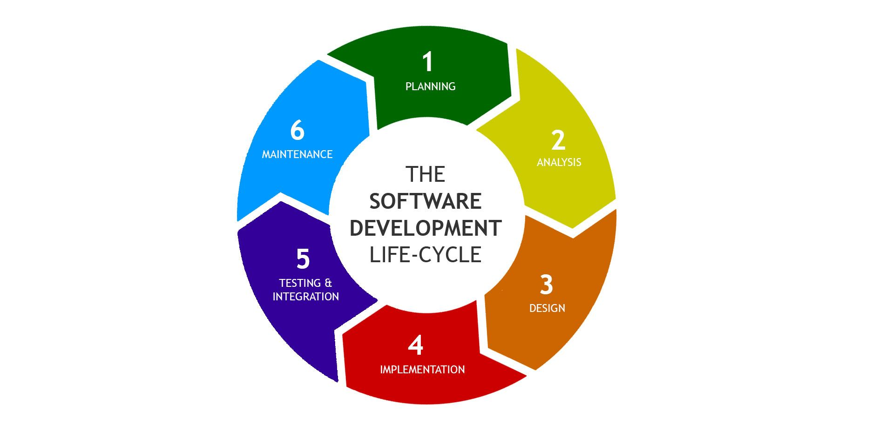

# This is my first Website

**Jay chovatiya**
# DevOps - Development and Operations
  

## Table Of Contents Outline
  **1. Basics of Software Engineering Agile Methodology and DevOps Process**
  
  **2. Exploring Linux for DevOps**
  
  **3. Cloud Computing and DevOps**
  
  **4. Managing Source Codes**
  
  **5. Building the Code**
  
  **6. Automated Testing and Test-Driven Development**
  
  **7. Continuous Integration and its Tools**
  
  **8. Managing Configuration in DevOps**
  
  **9. Docker in DevOps**
  
  **10. Puppet and Chef for DevOps**
  
  **11. SaltStack for DevOps**
  
  **12. System Monitoring in DevOps using Splunk**
  
  **13. Nagios for DevOps**    

## Exam Details

| **Exam Codes**          | DevOps S08-515 | 
| ----------------------- |:--------------:|
| **Number of Questions** |       60       |
| **Length of Test**      |  120 Minutes   |
| **Passing Score**       |       70%      |

## Basics of Software Engineering Agile Methodology and DevOps Process

### Static Requirements
  ...A static requirement is a requirement whose lifecycle extends beyond the delivery of the product or service. The service management organization, uses the requirement again to determine whether the product / service still meets the requirements. Where further discussed in this article about product is also meant service.
  
   + **Water fall Model:**
    
   
   + **Kanban model:**
    
 
### Dynamic Requirements
  ...A dynamic requirement is a requirement that the dynamic requirement is linked.
  
### Tangible Software

  + **Prototype Model:**
   
 
### Requiremnt Gathering
  - **Development Cycle**
  - **Production Server** - App store,Play store, Github,Windows store
  - **Realease v1** - Remove bug,Add features,modifypermission
  
  + **Software Development Life Cycle:** 
    
  
  

[Google](https://www.google.com)

